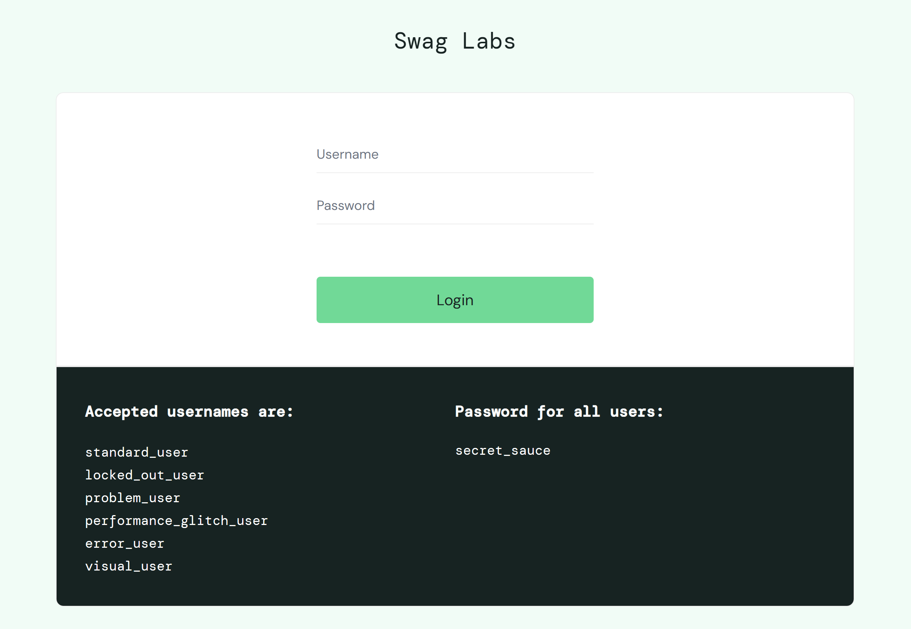
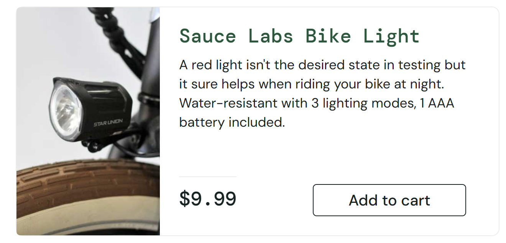
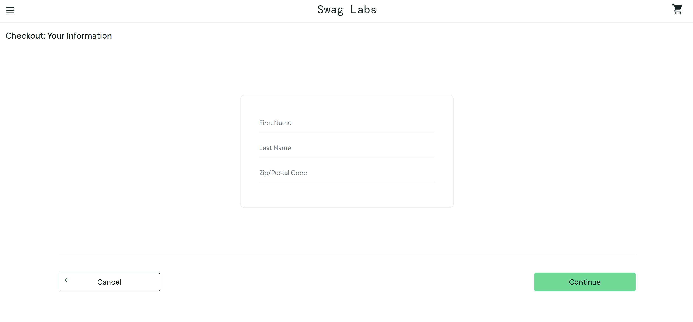

# swaglab_testing

<!-- ABOUT THE PROJECT -->
## About The Project
Sauce Labs Platform for Test
https://www.saucedemo.com/ 

Saucedemo (by Sauce Labs) - This is a free, open-source e-commerce application perfect for practicing automation skills in a retail context. 

<!-- GETTING STARTED -->
## Getting Started
The website is already hosted and available at https://www.saucedemo.com/ 

Saucedemo offers login functionality, shopping carts, and basic product information.

* Login functionality - Login functionality with different browsers(chrome and firefox) with the username and password.

  

* Shopping carts - Adding and removing elements from cart

   
   

* Product transactions - Login to the URL with the provided correct username and password, and add an item to the cart, 

* Advanced product operations - Clicking on the product sort container, and Verify address details in checkout page 

    

### Test data
The test data used for automation testing:
* Usernames and passwords
* User information (First name, Last name, Zip/Postal Code)

### Dependencies
* Windows or Linux OS
* VS code editor
* Python installed within virtual env
* Robot Framework
* Selenium Library
* Knowledge of XML

### Usage

1. Open the project in VS Code or your preferred IDE.
2. Navigate to the `src/robot` directory.
3. Locate the test files with the `.robot` extension.
4. Run the test files using VS Code to execute the automated test scenarios.

### Contributing

Contributions to this project are welcome! If you identify any issues or wish to enhance the existing test suite, please feel free to create pull requests.